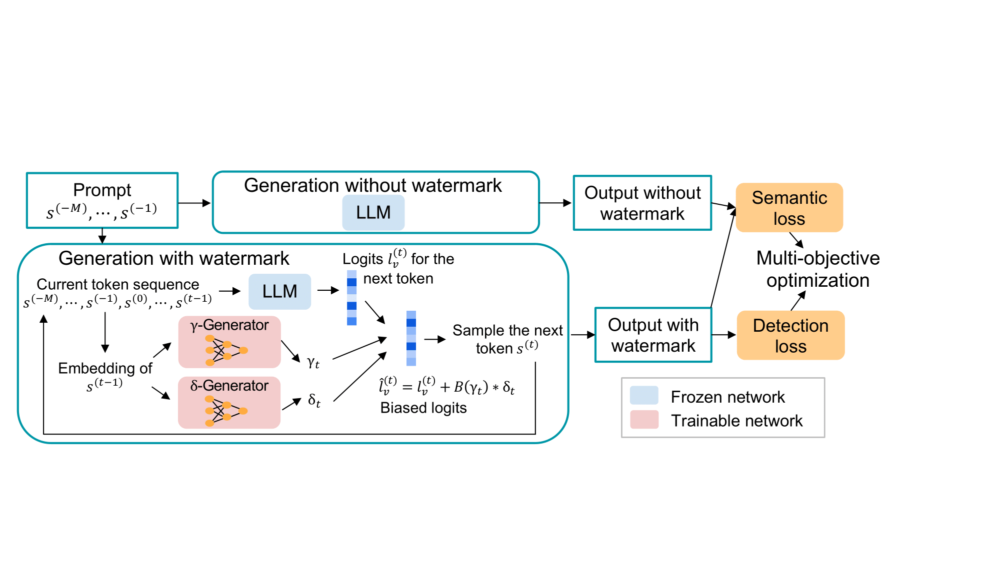

# Token-Specific Watermarking with Enhanced Detectability and Semantic Coherence for Large Language Models

This repository contains the code for our ICML 2024 paper on **Token-Specific Watermarking with Enhanced Detectability and Semantic Coherence for Large Language Models**. You can read the full paper [here](https://arxiv.org/abs/2402.18059).

## Introduction

We introduce a novel watermarking method for large language models (LLMs), focusing on two primary objectives: 

- **Detectability**: Measured by the z-score.
- **Semantic Coherence**: Assessed by the cosine similarity between the embeddings of watermarked and non-watermarked texts.

These metrics are controlled by two hyperparameters: the split ratio ($\gamma$) and watermark logit ($\delta$). These values are adjusted for different tokens to account for their unique characteristics.

To determine token-specific values for $\gamma$ and $\delta$, we use two lightweight networks: the $\gamma$-generator ($G_\gamma$) and the $\delta$-generator ($G_\delta$). These networks are optimized using a specialized multi-objective optimization framework. Below is an overview of our proposed method:



## Environment Setup

Ensure that all packages listed in `requirements.txt` are installed in your environment.

## Demo

For a quick start, refer to `demo.ipynb`. This notebook generates watermarked text from a given prompt and computes the z-score, PPL, and SimCSE.

## Training

To train the network, run the following command:
```
bash run_pipeline.sh
```

Select between Multi-Objective Optimization (MOO) or Weighted Sum for training:
- For MOO: `z_score_factor=1.0`
- For Weighted Sum: `z_score_factor=4e-4`

## Evaluation

### Default Settings

- **LLM**: OPT-1.7B 
- **Sampling**: Multinomial sampling with temperature=1.0, top_k=50
- **Dataset**: C4 realnewslike official validation split from Hugging Face. It is further divided into our validation and test sets, with the test split as the default.
- **Sample Generation**: 500 prompts, with each generates 200 tokens.
- **Batch Size**: Default is 20, requiring approximately 30GB of GPU memory for OPT-1.7B model.

### Configuration File

To modify default settings, check the [config](config) folder. For details on each keyword, refer to [config/README.md](config/README.md). 

### Running Evaluation

Results are stored in the `eval` folder by default.

- **Our Method**:
  ```
  CUDA_VISIBLE_DEVICES=0 python watermark.py --config_file config/TS.yaml
  ```
    * **If testing on llama models**, in [config/TS.yaml](config/TS.yaml), change the `model_name_or_path` to the desired model or local location, and also change `ckpt_path` to be `ckpt/llama/init_0.25_1.75_default.pth`.
    * Adjust watermark strength by using checkpoints trained from other initializations in `ckpt` folder.

- **KGW**:
  ```
  CUDA_VISIBLE_DEVICES=0 python watermark.py --config_file config/KGW.yaml
  ```

## Citation

If you use this work in your research or applications, please cite it as follows:
```
@article{huo2024token,
  title={Token-Specific Watermarking with Enhanced Detectability and Semantic Coherence for Large Language Models},
  author={Huo, Mingjia and Somayajula, Sai Ashish and Liang, Youwei and Zhang, Ruisi and Koushanfar, Farinaz and Xie, Pengtao},
  journal={arXiv preprint arXiv:2402.18059},
  year={2024}
}
```
